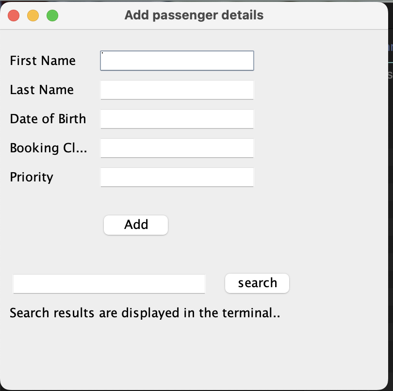
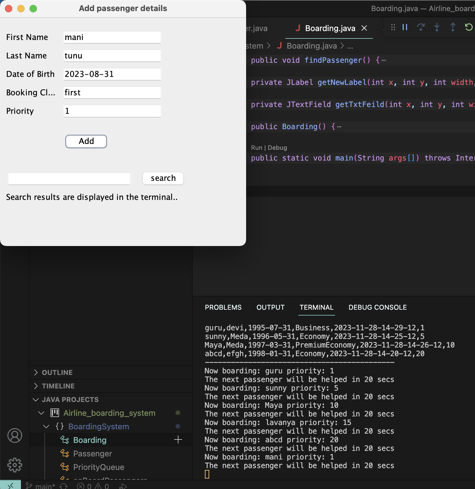
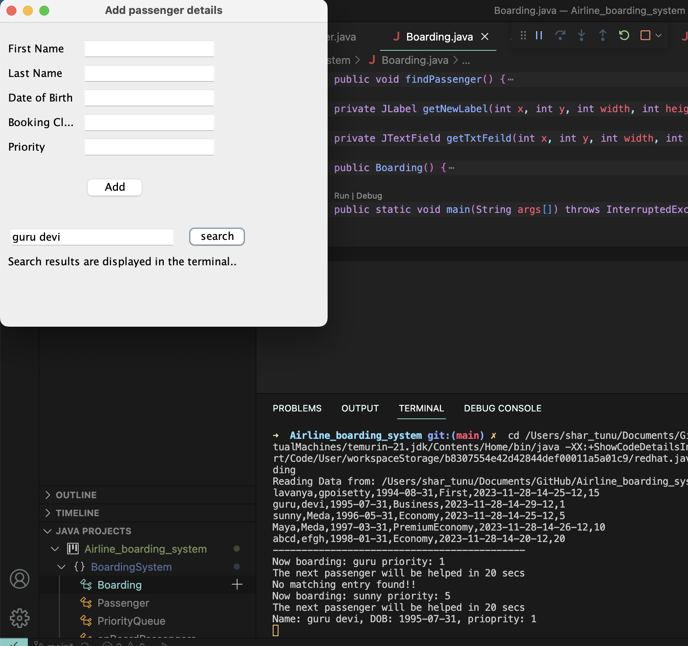
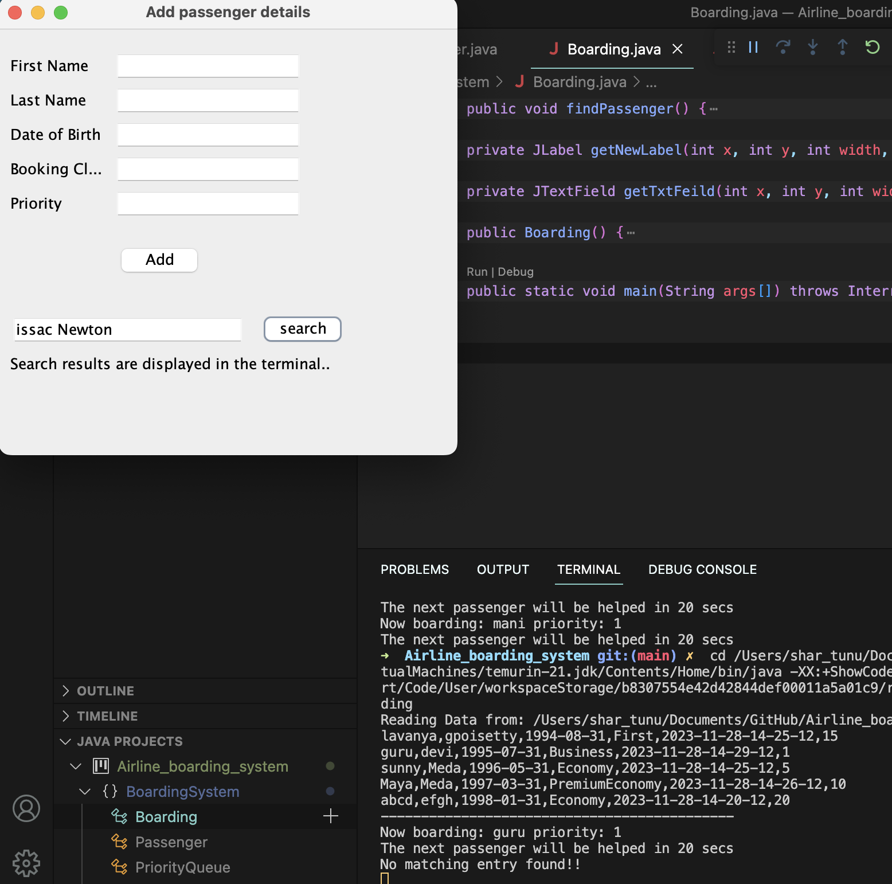

**Implementation Approach**

- Create a passenger class to store each passenger's data as a class object

- The csv file have the priority column and the objects are added to the queue based on that priority

- Read the list of passengers from the csv file and store them in a queue and sort them by priority

- Start the boarding process with the passenger on top of the queue. Pop the top of list and wait for 20 secs.

- If there are no new inputs during the wait time board the the next passenger thats top of the queue.

- Add new passengers via GUI.

- If there is a new passenger during wait time add the new object to queue and sort it to fit the new arrival based on priority

- The loop exits when the passenger count hits 15 or 10 minutes has elapsed since the start of the code execution.

- The on boarded passengers are added to the hashtable from java collections

- The above table can be searched/filtered from the GUI.

**Execution and some screen shots**

- Compile and run the code.
- The csv is loaded into the priority queue list
- And a GUI is displayed as below:

<p align="center">
  
</p>

- After the code is run, you can observe the terminal updating with passengers details who are being onboarded every 20 secs

<p align="center">
  
</p>

- You can add passengers to queue at any time and they will be considered for on boarding based on their priority.

<p align="center">
  
</p>

- To use the search bar please use ```<first name> <lastName>``` together with space seperating them and the result of the search is displayed in the terminal.

<p align="center">
  
</p>

<p align="center">
  
</p>
